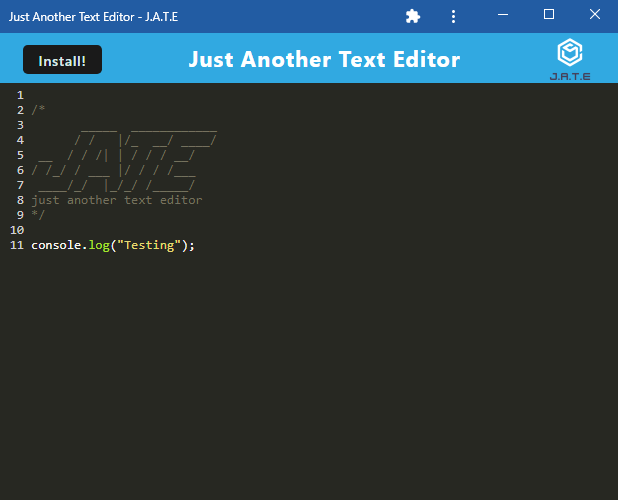

# PWA-Text-Editor

## Description

This application is a text editor that meets the criteria of a progressive web application.

## Table of Contents

- [Screenshots](#screenshots)

- [Installation](#installation)

- [Usage](#usage)

- [License](#license)

- [Contributing](#contributing)

- [Deployed Application](#deployed-application)

- [Questions](#questions)

## Screenshots

## Installation

To install the application, click the "Install!" button in the upper left corner and press "Install" on the pop-up window.

## Usage

This application can be used as a basic text editor where you can create notes or code snippets.

## License

The license being used for this application is the MIT license.

## Contributing

Much of the code for this project was borrowed from the Unit 19 mini project.

## Deployed Application

https://stormy-bastion-92325-ea4cdc8d0d19.herokuapp.com

## Questions

If you have any questions feel free to reach out to me at my email nnamdionyeije@gmail.com or through my GitHub at [https://github.com/nnamdionyeije](https://github.com/nnamdionyeije/).
